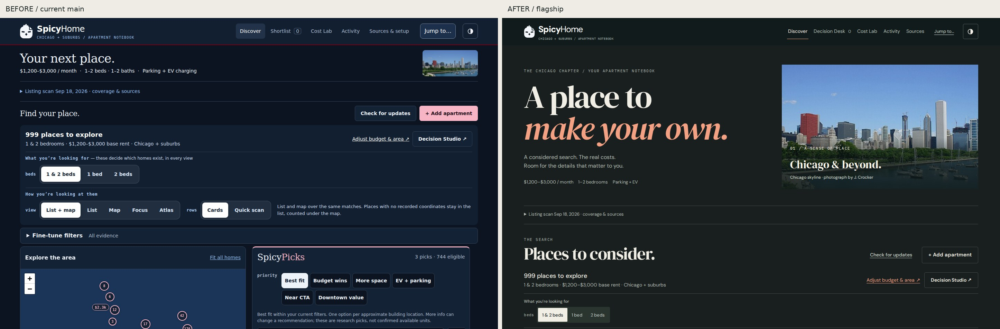
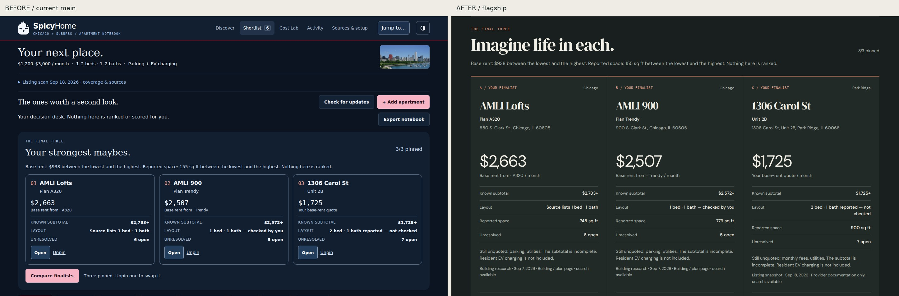
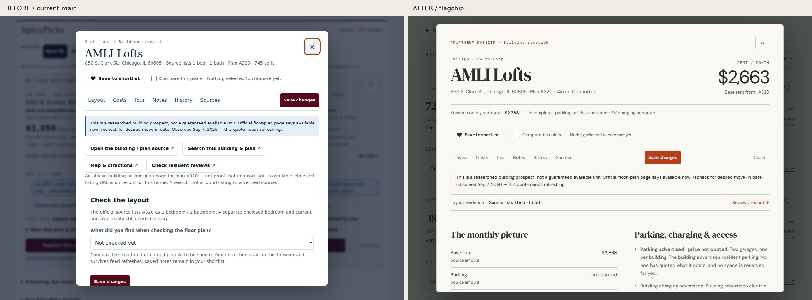

# SpicyHome flagship experience

**Architectural editorial × personal decision notebook.** Property identity,
money with its basis, and readable evidence lead the composition. The existing
decision journey and data model remain intact.

Repository: `spicyChicken59/SpicyHome`

Branch: `astra/flagship-visual-experience`

Verified base: `50c1b680587b0f1b3a45171c224618d6fe1dc345`

Product implementation: `704152fc247326fceb05962a61ac1a801a920238`

The PR supplies the exact final head, including this evidence commit. Main was
fetched and reverified before implementation and again before preparing review;
no competing open PR or new main commit appeared.

## What changed and why

The old opening was dominated by control groups. Finalists were a compact
utility shelf, and the dossier put editable controls and external links ahead
of money. The new opening has a large editorial title and clearly identified
Chicago context. Discover uses open property rows, and research picks are an
optional reading section with their reasons immediately visible when opened.

Final Three is a three-column portfolio on desktop and three complete vertical
candidate sections on phones. Each retains its plan/unit, price basis, subtotal,
missing costs, evidence state and next action. Letters identify candidates;
there is no new score, winner or ranking.

The dossier starts with identity and money, then source facts, unknowns, source
provenance, separate source/personal history, and the personal field notebook.
Layout editing recedes into a disclosure. Its sticky controls keep sections,
Save and Close reachable. Comparison has a wide table with persistent column
identities and a separate paired layout on phones. Tour Companion, Cost Lab,
Price Pulse, saved-home review and recoverable ruled-out records share the same
charcoal/spice or warm-paper visual language.

## Before / after

All six contact sheets were inspected, along with full-size key surfaces and
the specific screenshots that prompted repairs. Each sheet includes 18
captures: opening, list, map/list, Focus, both dossier/source classes, desk,
finalists, comparison, history, tour, Cost Lab, Price Pulse, empty and archive.

| Viewport and theme | Before | After |
| --- | --- | --- |
| 1440×900 dark | [Contact sheet](evidence/before-1440-dark-contact.jpg) | [Contact sheet](evidence/after-1440-dark-contact.jpg) |
| 1280×900 dark | [Contact sheet](evidence/before-1280-dark-contact.jpg) | [Contact sheet](evidence/after-1280-dark-contact.jpg) |
| 1280×900 light | [Contact sheet](evidence/before-1280-light-contact.jpg) | [Contact sheet](evidence/after-1280-light-contact.jpg) |
| 390×844 dark | [Contact sheet](evidence/before-390-dark-contact.jpg) | [Contact sheet](evidence/after-390-dark-contact.jpg) |
| 390×844 light | [Contact sheet](evidence/before-390-light-contact.jpg) | [Contact sheet](evidence/after-390-light-contact.jpg) |
| 320×740 dark | [Contact sheet](evidence/before-320-dark-contact.jpg) | [Contact sheet](evidence/after-320-dark-contact.jpg) |

Additional direct comparisons: [light opening](evidence/1280-light-opening.jpg),
[mobile finalist](evidence/390-dark-final-three.jpg),
[mobile dossier](evidence/390-light-dossier-provider.jpg),
[mobile listing](evidence/390-dark-listing.jpg),
[320px comparison](evidence/320-dark-comparison.jpg),
[light Price Pulse](evidence/390-light-price-pulse.jpg),
[320px tour](evidence/320-dark-tour.jpg).

Complete finalist compositions: [1440 dark](evidence/1440-dark-finalists-full.jpg),
[1280 light](evidence/1280-light-finalists-full.jpg),
[390 dark](evidence/390-dark-finalists-full.jpg),
[320 dark](evidence/320-dark-finalists-full.jpg).
The [lower comparison facts](evidence/1280-dark-comparison-lower-facts.jpg)
show the persistent identities and Close action.

## Material files

| File | Responsibility |
| --- | --- |
| `dist/index.html` | Authored opening, navigation labels, local font preloads |
| `dist/app.js` | Listing, finalist, dossier and comparison markup; optional research disclosure; explicit archive identity |
| `dist/flagship.css` | App-specific composition, typography, both themes, responsive and sticky behavior, reduced motion |
| `dist/style.css` | Removes the app's external font import; existing mechanics remain |
| `dist/assets/fonts/` | Four small licensed WOFF2 files, licenses and hash provenance |
| `tests/app.test.mjs` | UI wording/disclosure expectations and stronger archive-copy assertions |
| `tools/browser_check.mjs` | Existing 469 assertions retained; opens the new source/research disclosures and uses bundled fonts |
| `tools/flagship_check.mjs` | Real-control notebook journey and 89 focused layout, keyboard, contrast and evidence checks |
| `tools/visual_review.mjs` | Reproducible six-viewport capture harness |

## Verification

See [verification.json](verification.json) for measured results and provenance,
[ART_DIRECTION.md](ART_DIRECTION.md) for the baseline diagnosis and settled
system, and [VISUAL_REVIEW.md](VISUAL_REVIEW.md) for screenshot-derived repairs.
Raw PNGs and command logs are supplied in the separate handoff evidence bundle.

| Command | Result |
| --- | --- |
| `npm ci --ignore-scripts` | PASS |
| `npm test` | 246/246 PASS |
| `SPICYHOME_TEST_CLOCK_SKEW_DAYS=7 npm test` | 246/246 PASS |
| `SPICYHOME_TEST_CLOCK_SKEW_DAYS=30 npm test` | 246/246 PASS |
| `SPICYHOME_TEST_CLOCK_SKEW_DAYS=400 npm test` | 246/246 PASS |
| `npm run check` | JavaScript syntax + 43 Python tests PASS |
| `python tools/check_site.py` | 22 immutable assets + 1,000 records PASS |
| `npm run browser-check -- --shots <evidence-directory>` | 469/469 PASS |
| `node tools/flagship_check.mjs <evidence-directory>` | 89/89 PASS |
| `node tools/visual_review.mjs --shots <evidence-directory>` | 108 PNGs; 102 viewport measurements, zero overflow or page errors |
| `git diff --check` | PASS |

The fresh-profile journey covers filters, list/map/Focus, provider and curated
dossiers, three saves and finalists, comparison, sources and missing costs,
both histories, Cost Lab, a personal layout check, $0 parking, dated quote,
notes, resolved questions, rule-out/recovery, reload, export/import and an
archived home whose current availability remains unverified.

Accessibility checks cover keyboard-only entry/save/source reading/dismissal,
focus return, visible interactive focus, labelled native controls/disclosures,
44px tour targets, long-name wrapping, sticky clearance, 200% zoom in the
repository gate, rendered Price Pulse filter contrast and reduced motion on the
open dossier. Measured normal-text palette pairs exceed 4.5:1 in both themes.
This is scoped browser verification, not a claim of comprehensive assistive
technology certification.

## Performance observations

Three local desktop runs per version used the same 1,000-record feed, Chromium,
blocked external resources and the existing 200ms search debounce. Median
navigation-to-results was 2,388ms before and 2,353ms after; median search-fill to
filtered results was 921ms for both. This small shared-runner sample shows no
observed regression; it is not a field performance benchmark.

The app adds 100,956 bytes of self-hosted font files and no runtime dependency.
There are no new property images, backdrop blurs, scroll effects or render-time
measurement loops. The existing 88,669-byte city photograph is reused.

## Provenance, semantics and limits

- Shared design remains **v2.13.0**, commit
  `14a752dd0269bd6ebbb7080eb0d9e1922cd1ef2c`: **22 assets, zero hash drift**.
- Property imagery inventory: **none** in the committed 1,000 records. The only
  photograph is existing Chicago context, credited to J. Crocker / Wikimedia
  Commons. No property imagery was generated or acquired. Marks and Leaflet
  cartography keep their existing provenance.
- `dist/model.js`, feed/history data, provider code, query semantics, budgets,
  availability interpretation, storage schema, workflows and shared assets are
  unchanged. Source/provider, personal, computed and unknown evidence remain
  distinct. $0 remains an amount; incomplete remains incomplete.
- PR #28 quote-date provenance is preserved: observation day or unknown,
  recording timestamp and correction history remain distinct. Source and
  personal series remain separate. An unknown day creates no freshness.
- The archive copy now says the record is absent and availability unverified;
  it no longer describes every query as capped. It does not infer unavailability.
- All saved/tour/quote exercises are synthetic notebook state over committed
  fixtures. Screenshots and tests are not apartment verification.
- External map tiles and font services are blocked in captures. Before uses
  available fallback fonts; after uses bundled fonts. Live tile delivery and
  public-origin acceptance are **NOT RUN**. Safari and physical-device testing
  are not claimed.
- The known separate Pages/Jekyll `./docs` failure remains deferred. No Pages
  setting or workflow is changed. **Merging this PR, which touches `dist/**`,
  triggers the existing `Publish website` workflow and its dist publication
  path.** This milestone does not merge or publish.

Keep the evidence contract, notebook compatibility and app-local art direction.
No consequential visual defect remains from these reviews. Defer new property
imagery, provider changes, Pages configuration, shared-pattern promotion and
legacy historical editing. Omit fabricated imagery, new scoring/winners,
dashboards, framework migration and gratuitous motion.

Next action: independent merge audit of the single PR, followed by public-origin
acceptance only after an approved merge and the existing publication completes.
